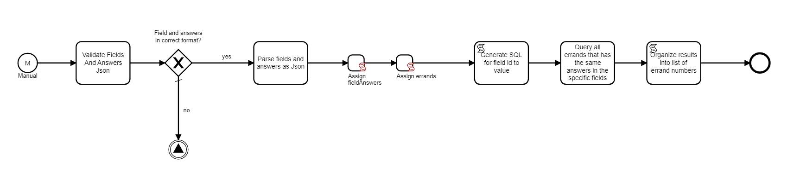

# Abou-Get-Errands-By-Field-Values
Letar i Abous databas efter samtliga ärenden som innehåller specifika fältsvar.

# Filer
- Get Abou Errand Numbers By State and Field-Values.json
  - BPMN mallen för subprocessen som hämtar ut samtliga ärendenummer som innehåller specifika fältsvar. Fältsvaren konfigureras i subprocessens textfält på start-noden.

# Miljövariabler
- Gruppnamn
  - AbouReadDB
- Variabler
  - Database (text)
  - UserId (text)
  - Password (secret)
  - Server (text)
